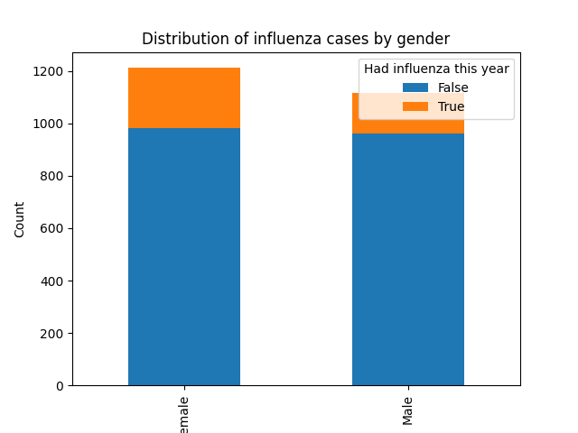
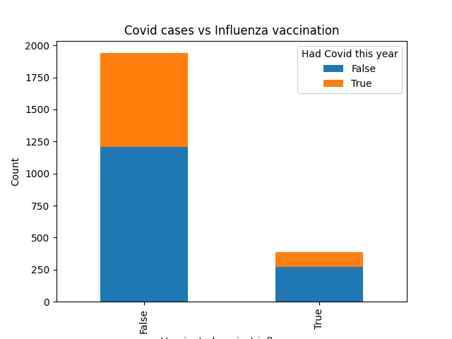

# Data Science Course

## Lab 01 - Familiarization with open source data sets and their preliminary research

Dataset: [Twitter US Airline Sentiment](https://www.kaggle.com/datasets/crowdflower/twitter-airline-sentiment)
Notebook: [01.ipynb](./notebooks/01.ipynb)

## Lab 02 - Data transformation. Fundamentals of statistical analysis

Notebook: [02.ipynb](./notebooks/02.ipynb)

